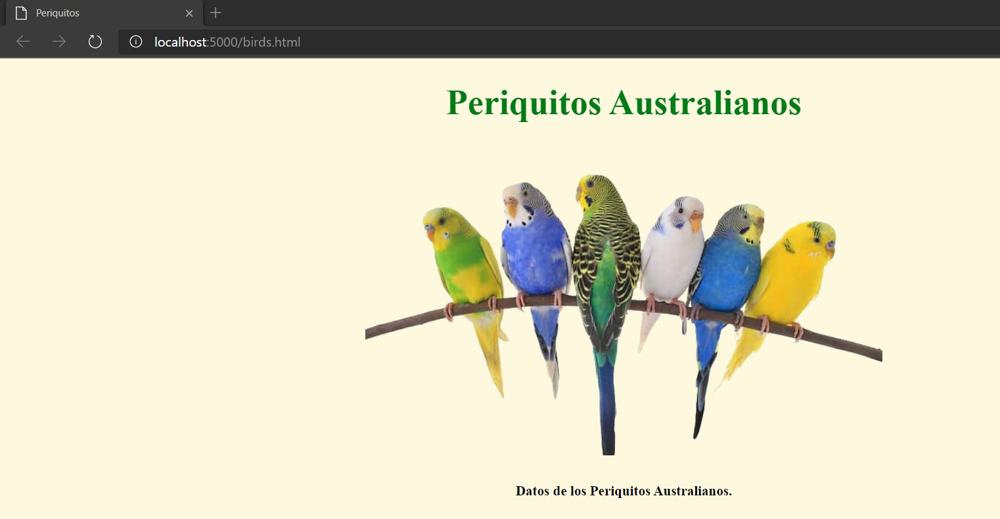
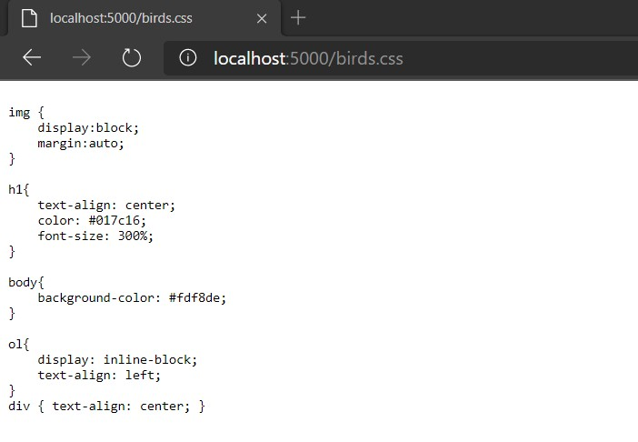
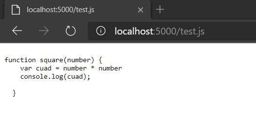
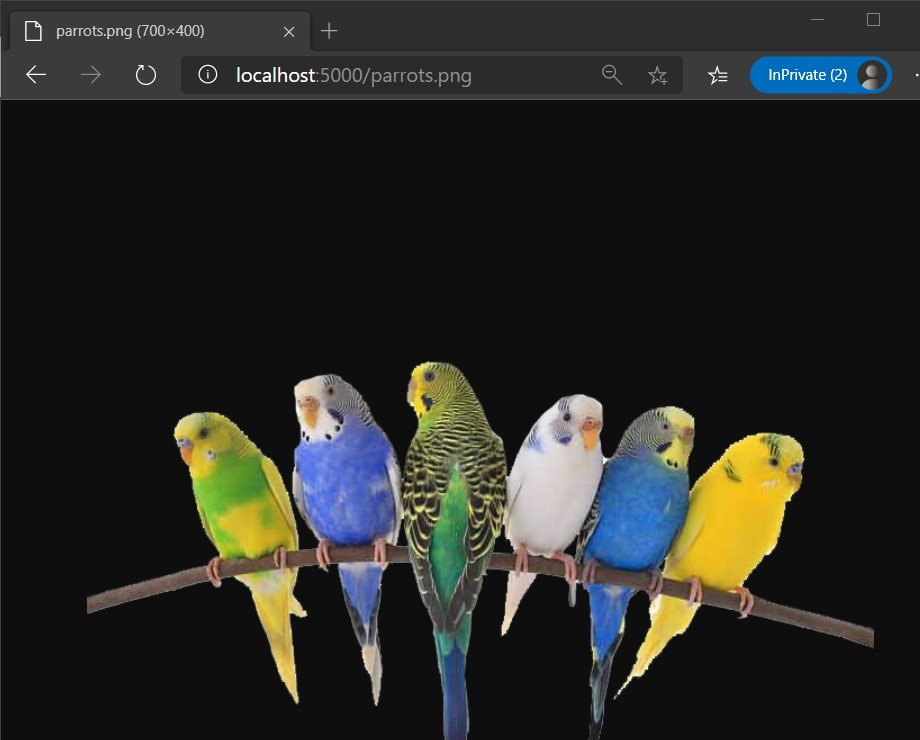

# AREP - Laboratorio #4
El ejercicio consiste en construir un servidor Web (tipo Apache) en Java. El servidor debe ser capaz de entregar páginas html e imágenes tipo PNG. Igualmente el servidor debe proveer un framework IoC para la construcción de aplicaciones web a partir de POJOS. 

## Definiciones

## Comenzando 
Para obtener una copia local del repositorio puede ejecutar la siguiente línea en la consola de comandos.
    
    git clone https://github.com/Ricar8o/AREP-Lab03-Servidor.git

## Pre-requisitos

Debe tener instalado lo siguiente:

* [GIT](https://git-scm.com/book/es/v2/Inicio---Sobre-el-Control-de-Versiones-Instalación-de-Git)
* [JAVA 8](https://www.java.com/es/download/)
* [MAVEN](https://maven.apache.org)

GIT no es completamente necesario pero si es recomendable, también puede descargar el repositorio como un .zip.

## Otras Tecnologías
* [Heroku](www.heroku.com) - Es una plataforma como servicio (PaaS) que permite a los desarrolladores crear, ejecutar y operar aplicaciones completamente en la nube.

## Pruebas y Compilación

Para compilar el proyecto podemos ejecutar varias opciones. 

* Para compilar el codigo fuente únicamente.

        mvn compile

* Para ejecutar todas las fases.

        mvn package

## Ejecución
Para ejecutar el programa puede hacerlo desle la linea de comandos ejecutando el siguiente comando.

        java -cp target/classes co.edu.escuelaing.arep.sparkr.SparkRWebServer

El servidor se ejecutara por defecto en http://localhost:36000

### Heroku (Opcional)
Si tiene instalado heroku puede ejecutar el siguiente comando en la carpeta del repositorio:

        heroku local web

NOTA: 
En el repositorio se encuentra un archivo llamado [Procfile](/Procfile).

Si esta en linux deberia ejecutarse sin problema, en el caso de que este en windows basta con borrar la parte "$JAVA_OPTS".
 

 
## Desplegando de manera local

Para el ejemplo lo demostraremos con heroku.
Con heroku la dirección sera http://localhost:5000

### Obteniendo archivos

### Probando el framework

## Despliegue en heroku 
Si quiere ver como funciona la pagina de este repositorio de click al botón.

o vaya a https://radiant-sands-89858.herokuapp.com.

## Despliegue Circleci

## Documentación

La documentacion se encuentra en la carpeta del repositorio llamada [docs](docs), pero en caso de que quiera generarla tiene las siguientes opciones.

### Maven
Para generar la documentacion con Maven puede ejecutar cualquiera de los siguientes comandos.

*        mvn javadoc:javadoc
*        mvn javadoc:jar

### Java
Si quiere generarla usando java puede hacerlo con el siguiente comando.

*       javadoc -d docs src\main\java\co\edu\escuelaing\arep\sparkr\*.java src\main\java\co\edu\escuelaing\arep\sparkr\httpserver\*.java

## PDF Diseño

[Arep_Lab_3.PDF](Arep_Lab_3.pdf)

## Autor 

Andrés Ricardo Martínez Díaz - [Ricar8o](https://github.com/Ricar8o)

## Licencia
Mire el archivo [LICENSE](LICENSE) para más detalles.
