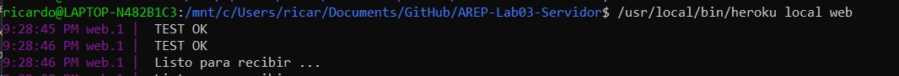
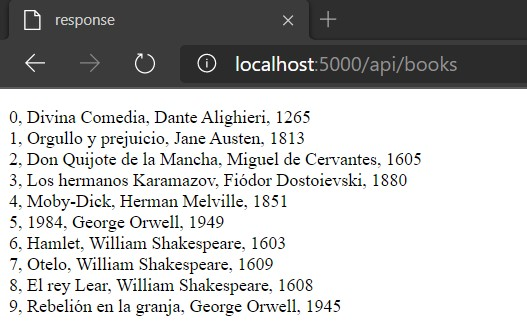
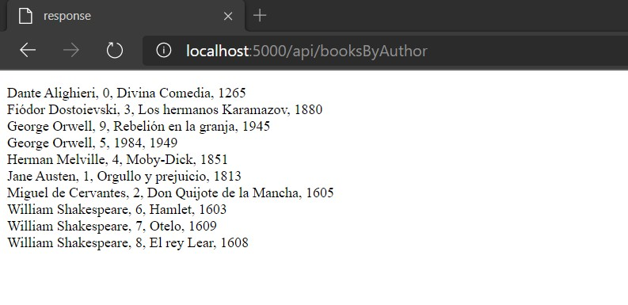
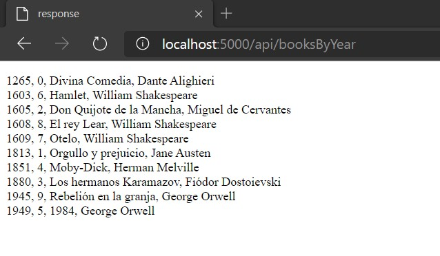

# AREP - Laboratorio #3
El ejercicio consiste en lograr dos retos.
## Reto 1
- Escribir un servidor web que soporte múltiples solicitudes seguidas (no concurrentes). El servidor debe retornar todos los archivos solicitados, incluyendo páginas html e imágenes. 
- Construir un sitio web para probar el servidor. 
- Desplegar la solución en Heroku. Sin usar frameworks web como Spark o Spring, solo Java y las librerías para manejo de la red.

## Reto 2 (Avanzado)
- Usando el servidor del reto 1, escribir un framework similar a Spark que le permita publicar servicios web "get" con funciones lambda y le permita acceder a recursos estáticos como páginas, javascripts, imágenes, y CSSs. Sin usar frameworks web como Spark o Spring.
- Crear una aplicación que conecte con una base de datos desde el servidor para probar la solución. 
- Desplegar la solución en Heroku.

## Comenzando 
Para obtener una copia local del repositorio puede ejecutar la siguiente línea en la consola de comandos.
    
    git clone https://github.com/Ricar8o/AREP-Lab03-Servidor.git

## Pre-requisitos

Debe tener instalado lo siguiente:

* [GIT](https://git-scm.com/book/es/v2/Inicio---Sobre-el-Control-de-Versiones-Instalación-de-Git)
* [JAVA 8](https://www.java.com/es/download/)
* [MAVEN](https://maven.apache.org)

GIT no es completamente necesario pero si es recomendable, también puede descargar el repositorio como un .zip.

## Otras Tecnologías
* [Heroku](www.heroku.com) - Es una plataforma como servicio (PaaS) que permite a los desarrolladores crear, ejecutar y operar aplicaciones completamente en la nube.
* [CircleCI](https://circleci.com/) - Es una plataforma que ofrece integración continua en el codigo.

## Pruebas y Compilación

Para compilar el proyecto podemos ejecutar varias opciones. 

* Para compilar el codigo fuente únicamente.

        mvn compile

* Para ejecutar todas las fases.

        mvn package

## Ejecución
Para ejecutar el programa puede hacerlo desle la linea de comandos ejecutando el siguiente comando.

### Linux
        java -cp target/classes:target/dependency/* co.edu.escuelaing.arep.sparkr.SparkRWebServer

### Windows
        java -cp target/classes;target/dependency/*  co.edu.escuelaing.arep.sparkr.SparkRWebServer  

El servidor se ejecutara por defecto en http://localhost:36000

### Heroku (Opcional)
Si tiene instalado heroku puede ejecutar el siguiente comando en la carpeta del repositorio:

        heroku local web

### NOTAS: 

* En el repositorio se encuentra un archivo llamado [Procfile](/Procfile).
  Si esta en linux deberia ejecutarse sin problema, en el caso de que este en windows basta con borrar la parte "$JAVA_OPTS" y cambiar los dos puntos ":" por un punto y coma ";".

* Si Ejecuta la aplicación en un ambiente windows y no se muestran las imagenes en el navegador, vaya al archivo HttpServer.java a la linea 169 y quite el ultimo "\r" 
 

 
## Desplegando de manera local

Para el ejemplo lo demostraremos con heroku.
Con heroku la dirección por defecto será http://localhost:5000.

### Inicio 
Al ejecutar el servicio la aplicación intentara dos cosas, primero comprobara si tiene el driver de conexión de postgresql y luego intentara abrir una conexión a la base de datos.
Al final se conecte o no deberia empezar a correr el servidor web.

### Obteniendo archivos
HTML

CSS

JS 

PNG

### Probando el framework
Para la prueba se hizo una base de datos con una tabla básica de libros.

Obteniendo los datos de los libros.

Ordenados por autor.

Ordenados por año.

## Despliegue en heroku 
Si quiere ver como funciona la pagina de este repositorio de click al botón.

o vaya a https://radiant-sands-89858.herokuapp.com.

## Despliegue Circleci

## Documentación

La documentacion se encuentra en la carpeta del repositorio llamada [docs](docs), pero en caso de que quiera generarla tiene las siguientes opciones.

### Maven
Para generar la documentacion con Maven puede ejecutar cualquiera de los siguientes comandos.

*        mvn javadoc:javadoc
*        mvn javadoc:jar

### Java
Si quiere generarla usando java puede hacerlo con el siguiente comando.

*       javadoc -d docs src\main\java\co\edu\escuelaing\arep\sparkr\*.java src\main\java\co\edu\escuelaing\arep\sparkr\httpserver\*.java

## PDF Diseño

[Arep_Lab_3.PDF](Arep_Lab_3.pdf)

## Autor 

Andrés Ricardo Martínez Díaz - [Ricar8o](https://github.com/Ricar8o)

## Licencia
Mire el archivo [LICENSE](LICENSE) para más detalles.
